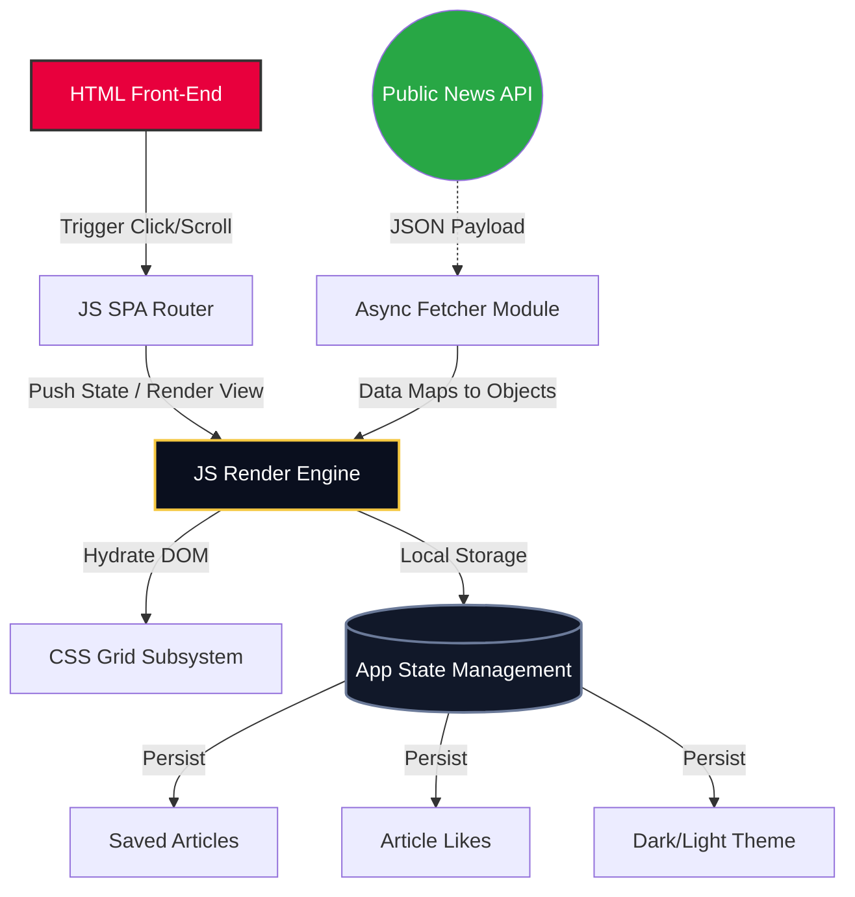
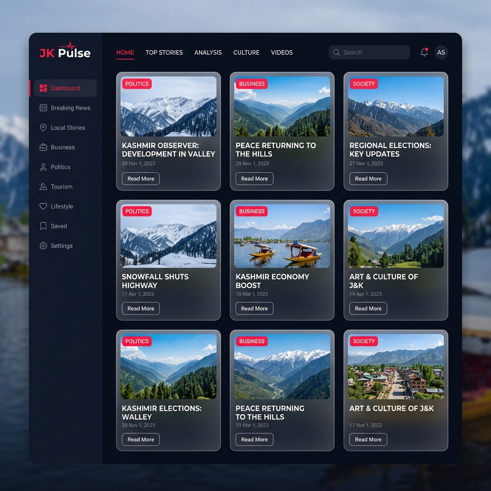
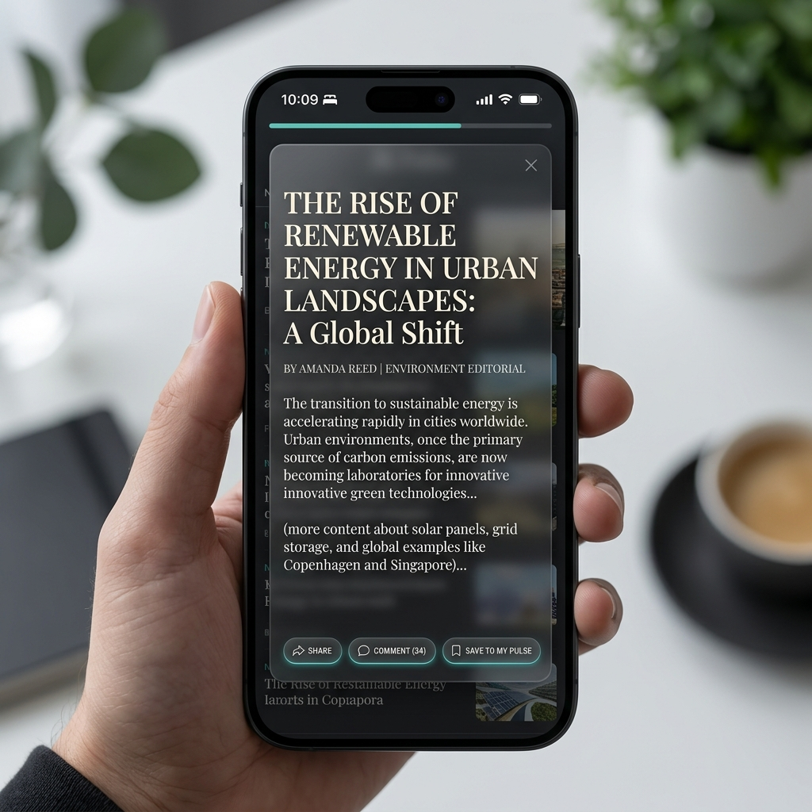

<div align="center">
  

  # 🌐 JK Pulse

  **Next-Generation Regional News Platform & SPA**  
  *Unapologetic journalism mixed with world-class UX.*

  [](#)
  [](#)
  [](#)
  [](#)
  [](#)
</div>

---

## 📖 Overview

**JK Pulse** is a state-of-the-art, dark-mode-first Single Page Application (SPA) designed exclusively for regional and global news distribution. Built completely without heavy frameworks or CSS libraries (No Bootstrap/Tailwind), this platform delivers buttery-smooth horizontal sliding animations, complex internal routing, and infinite data fetching all using **Pure Vanilla Javascript, HTML, and CSS**.

## ✨ Key Features

- **⚡ Zero-Reload SPA Routing:** Instantaneous navigation across 12 unique sections (National, World, Politics, Sports, etc.).
- **📡 Live News Fetching API:** Dynamically pulls and formats real-world headlines from global News API endpoints on the fly.
- **🎨 Proprietary Glassmorphism System:** Deep navy (`#0A0F1E`) and electric crimson (`#E8003D`) styling combined with frosted backdrop-filters.
- **📱 True Mobile-First Design:** Features a dedicated bottom app-style navigation bar, hamburger drawer, and fluid grid layouts.
- **🤝 Social Micro-Interactions:** Custom built X (Twitter) style heart-burst animations, real-time comment slider drawers, and robust local-storage persistence for Bookmarks & Likes.

---

## 🏗️ Architecture & Data Flow



---

## 📸 Interface Showcases

<div align="center">
    
    
</div>

> **Left:** The default Dark Mode view showcasing the Parallax Carousel and Breaking Tracker. **Right:** The immersive full-page Article Override Modal with tracking progress bars.

---

## 🚀 Getting Started

Because **JK Pulse** uses zero external dependencies, getting it up and running is as easy as starting a static file server!

### 1. Clone the repository
```bash
git clone https://github.com/your-username/jk-pulse.git
cd jk-pulse
```

### 2. Run a Local Server
**Using Python:**
```bash
python -m http.server 8000
```
**Using Node (npx):**
```bash
npx serve .
```

### 3. Start Browsing!
Navigate your browser to `http://localhost:8000`.

---

## 📂 Project Structure
```text
📦 jk-pulse
 ┣ 📜 index.html    # Base skeletal structure, skeletons, modals & navigation
 ┣ 📜 style.css     # 900+ lines of custom glassmorphism, responsive queries & animations 
 ┣ 📜 app.js        # Global state, SPA router mechanics, and API fetching logic
 ┗ 📜 README.md     # You are here!
```

---

## 👨‍💻 Developer & Motivation

Inspired by premium journalistic platforms and highly animated interfaces, **JK Pulse** attempts to prove that complex, enterprise-looking products can heavily rely on the basic building blocks of the web—HTML, CSS, and JS—without sacrificing code maintainability or load times.

<div align="center">
  <br>
  <i>Designed and hand-coded to perfection.</i>
  <br><br>
</div>
