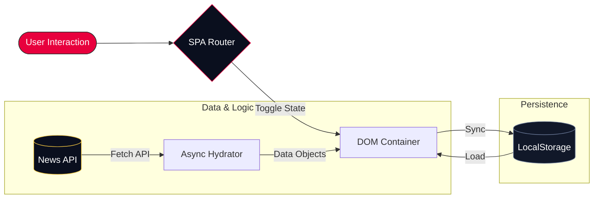

# JK Pulse — High-Performance Regional News SPA
### Developed by Piyush Baviskar

---

## 💡 The Vision
**JK Pulse** was born out of a desire to bridge the gap between high-end international media UX and regional news storytelling. My goal was to build a platform that feels as fast as a native mobile app but remains accessible through any web browser. 

Inspired by the bold editorial style of modern digital journalism, I focused on three core pillars: **Visual Energy**, **Reliable Data**, and **Frictionless Transitions**.

## 🛠️ Technical Philosophy
Unlike many modern projects that rely heavily on bloated frameworks, I chose a **"Vanilla First"** approach. Every interaction, transition, and data-fetch loop in this repository is hand-coded using pure HTML5, CSS3, and JavaScript. This ensures a minimal footprint, lightning-fast load times, and a deeper understanding of the underlying web APIs.

### Key Architecture
The application operates as a full Single Page Application (SPA). I implemented a custom routing logic that manages the DOM state without ever forcing a browser reload.



---

## 🔥 Features I Implemented

- **Dynamic News Hydration:** I integrated a live fetching module that pulls real-time headlines from global sources, ensuring the content is always fresh.
- **Glassmorphism UI System:** Every card and sidebar uses a custom CSS blur and border-lighting system I designed to provide depth without sacrificing performance.
- **PWA Integration:** The app includes a valid Service Worker and Manifest. This means you can "Install" JK Pulse on your phone, and it will even work offline by caching previous news entries.
- **Social Interaction Engine:** I built custom "X-style" interactions, including heart-burst micro-animations for likes, bookmarking persistence, and a sliding threaded comment drawer.
- **Responsive Navigation:** A complete mobile-first layout with a custom bottom navigation bar and hamburger menu for seamless one-handed usage.

---

## 🏗️ Technical Breakdown

### Core Stack
- **Structure:** Semantic HTML5
- **Style:** Pure CSS3 (Variables, Flexbox, Grid, Keyframes)
- **Logic:** Vanilla JavaScript (ES6+, Async/Await)
- **PWA:** Service Workers, Caching API, Web Manifest

### Folder Structure
```text
.
├── index.html      # Main Application Shell & Modals
├── style.css       # Proprietary Design System & Layouts
├── app.js          # SPA Router, API Logic & State Management
├── sw.js           # Offline Service Worker
└── manifest.json   # PWA Configuration
```

---

## 🚀 Future Roadmap
I plan to continue evolving JK Pulse by adding:
1. **User Authentication:** Firebase or Node.js integration for cloud-synced bookmarks.
2. **Push Notifications:** Alerting users of breaking news in real-time.
3. **Advanced Analytics:** Tracking read-times and engagement to refine the news algorithm.

---

### Contact & Collaboration
I'm always looking to connect with other developers and creators. If you have any feedback or want to collaborate, feel free to reach out via my GitHub profile!

**Project by Piyush Baviskar**
